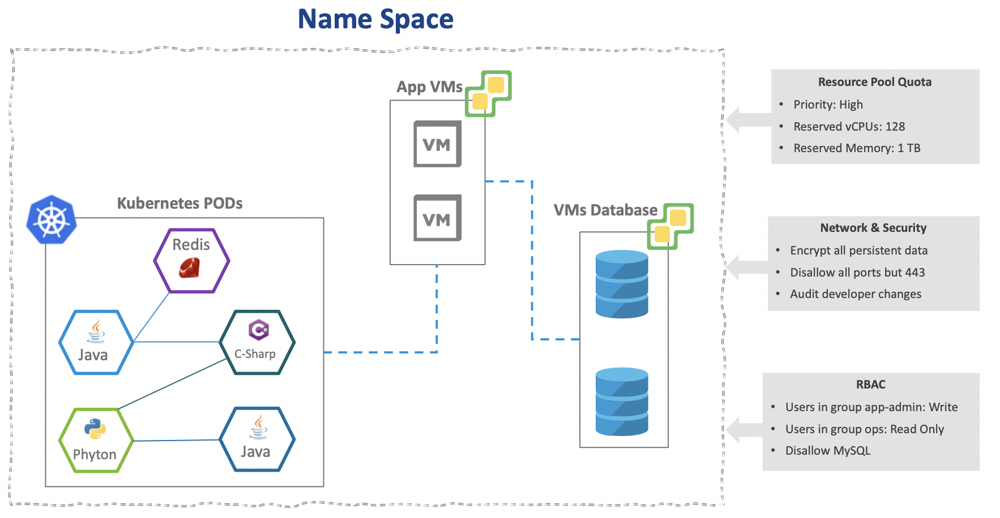

# Introduction to Project Pacific
[Home Page](https://github.com/roie9876/Pacific)

# Table Of Contents  

[Overview](#Overview)  
[Namespace](#Namespace)  
[The Supervisor Cluster](#TheSupervisurCluster)  
[Guest Cluster](#GuestClustrer)  
 

# Overview

During VMworld 2019 USA we announced project Pacific, the idea of this project is to bring closer two worlds, Developers/DevOps and the Operations team. The project transforms the vSphere layer and makes it the best place to run Kubernetes workloads natively on the hypervisor layer. 

The foundation of Project Pacific is VMware’s SDDC which consistent of vSphere in the compute layer, NSX for networking & security and vSAN for the storage.
  
One of the interesting aspects of Project Pacific is to leverage Kubernetes to consume VMware SDDC objects. DevOps team can now deploy hybrid applications (VMs and PODs) with declarative YAML files, while in parallel the VI admin can have better visibility into the Kubernetes world via the same vSphere UI and enforce control boundary of the compute resources the DevOps can consume.

Why we need a new way to consume VMware SDDC? 

Well, most of today’s applications are hybrid while some are fully containerized.  

  
With Project Pacific, we can now deploy a hybrid application with a single declarative YAML file that describes the desired state of the app.  
  

#  Namespace
In Kubernetes, we have an object called a namespace.
Namespace allows us to create a tenancy construct inside the cluster, in addition we can partition the cluster and assign RBAC and other quota restrictions into the namespace object.

Project Pacific adds namespace construct directly into vSphere.
For example, a hybrid application which is shown below consists of Kubernetes objects and vSphere VMs objects, all placed into a single namespace visible in the vCenter UI.

Now we can apply resource compute quota (CPU and Memory), Network & Access policy and RBAC to this new unified namespace.    

# The Supervisor Cluster
Once Project Pacific is enabled from the vCenter UI, we will inject Kubernetes into the control plane of vSphere, you can think of it like vSphere on Steroids :-).   

Project Pacific first step is to deploy new demon inside the ESXi host called Spherelet, for those who are familiar with Kubernetes this is the equivalent to kubelet.  By running the Spherelet demon in the ESXi it act’s as Kubernetes Worker node.  Spherelet is an agent running inside the ESXi host and responsible for the health of the Kubernetes POD’s that will run inside the ESXi host, Spherelet monitors the PODs status and manages the lifecycle of the PODs aka start, restarts or kill the PODs if necessary. Another job of Spherelet is to “watch” the Kubernetes API server (explain later) and see if their new PODs that need to deploy.

  

The next step is to deploy the Control Plane Nodes (also known as the Kubernetes Masters). We deploy Master Node’s in an odd number, and they are just regular VMs inside the ESXi cluster. We apply anti-affinity rules to avoid two Control Plane Nodes running on the same ESXi. The Control Plane VMs run few Kubernetes services such as API server, Scheduler, Controller Manager. Another imported service deploy inside is the etcd service witch function as Database of the Kubernetes. If you interesting to read more about this services, you can read my other blog:

http://www.routetocloud.com/2017/10/introduction-to-nsx-and-kubernetes/

After the Kubernetes Control Plane VMs successfully deployed,
The DevOps team can start interact with the Supervisor cluster and deploy applications.  

DevOps team can now interact with the cluster using kubectl which is the tool that they are using today. with kubectl they can interact with the supervisor cluster. 

for example, they can view the status of the nodes using the following command: 

As you can see from the output, we have 3 Kubernetes master nodes which are running as VM’s and 3 ESXi hosts that are now acting as the Kubernetes worker nodes.

A Summary of what we described so far:

Enabling Project Pacific on the vSphere cluster deploys Spherelet daemon on the ESXi and deploy Kubernetes control plane VMs (masters) this is what we call in Project Pacific the Supervisor cluster.
You can think of the supervisor as the foundation layer inside Project Pacific. We can add more functionality and create new services such as basic IaaS or DBaaS… 

Single Supervisor cluster is equal to a single Kubernetes Cluster.
DevOps team might want more than one Kubernetes cluster for other use cases on the same vSphere cluster, but what if we have only one vSphere cluster? 
For this we enable an option called guest cluster, this enables consumption of additional Kubernetes cluster that runs completely in a form factor of VM’s. 

This is exactly what we are doing in project Pacific with the Guest Cluster.

# Guest Cluster
Guest cluster is an upstream Kubernetes cluster that run’s inside a dedicated namespace, the main difference between the Guest Cluster (GC) and the Supervisor cluster (SC) is the fact that Guest Cluster run as VMs (Workers and Masters), In contrast to the Supervisor which runs the Kubernetes Worker nodes on the ESXi host’s.

Another point that is worth highlighting is the fact that the Supervisor cluster has a 1:1 relationship to the vSphere cluster, in other words, one vSphere cluster = one Supervisor cluster. on the other hand, we can deploy multiple Guest Clusters into the same Supervisor Cluster.

The Guest Cluster is owned by the DevOps/Developers and the lifestyle of this cluster managed by them, operations like scaling and upgrading the Guest Cluster is decupled form the lifecycle of the Supervisor cluster.

How Guest Clusters are being created?
The creation of the Guest cluster’s is achieved using the open-source project called Cluster-API. If you want to read more about Cluster API project use the following link:
https://github.com/kubernetes-sigs/cluster-api-provider-vsphere

In short, the idea of Cluster-API is to create the Kubernetes cluster from scratch, using the existing Kubernetes cluster, in Project Pacific, we leverage the Supervisor cluster to create the Guest Cluster. 

In order to create a Guest Cluster, we need to create virtual machines, right? 
but in fresh new Kubernetes, we don’t have any virtual machine objects as you may guess. therefore, Kubernetes is so cool, there is a technique to create new objects called Custom Resource Definition, or CRD in short. 

With CRD’s we can create new Kubernetes objects like VirtualMachine or even LogitcalGateway and leverage those like known Kubernetes objects - pods, services, etc.

But when a request comes in to create a virtual machine who is actually creating the Virtual Machine in the vCenter? 
This is a fair question because creating objects inside Kubernetes will not magically deploy VMs from nowhere.
This is where Kubernetes Operator kicked-in, the VMware Operator role is to talk to the IaaS layer (in our case is vCenter) and deploy/delete the virtual machine, It is obvious that VMware Operator do more than that, but for simplicity, you can think of VMware Operator as the component that responsible for all the IaaS and lifecycle tasks.

A good example of the lifecycle task can be to scale up the Guest Cluster. scaling the cluster = adding more worker nodes = deploy a new virtual machine to the Kubernetes cluster. obviously just deploy the VM is not enough, after the VM is deployed, the Operator will need to do all the necessary tasks to make sure this new VM contains all the software components and become part of the Kubernetes cluster.

The creation of the Guest Cluster is being done with a simple YAML file, for example:  

Deploying this YAML file into the Supervisor cluster will create new Kubernetes Guest Cluster.

With this blogpost I tried to simplify Project Pacific goal and go over the technical details of the project, hopefully now it makes more sense.

thanks to Amir Marouani for reviewing this log

[Back to Table of Contents](#Table-Of-Contents)